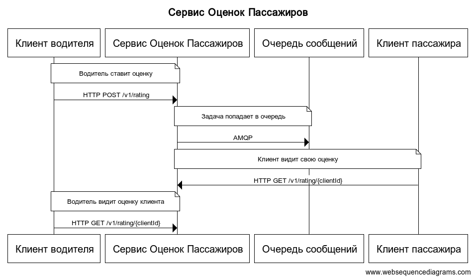

# Сервис оценок пассажиров
## Декомпозируйте фичу 

### Фича
 Возможность выставления оценки пассажирам
 от водителей после завершения поездки.
 
### Подзадачи
**Бекенд:**
* Разработка основных эндпоинтов:
    * поставить оценку пользователю
    * получить оценку пользователя
    
* Разработка модели данных
* Документация для эндпоинтов
* Разработка алгоритма подсчета оценки

**UX/UI:**
* Отображение оценки пассажира в приложении водителя
* Интерфейс выставления оценки в приложении водителя
* Отображение собственной оценки в приложении пассажира

**Фронтенд (мобильное приложение):**
* Реализовать предлагаемый интерфейс в приложении водителя
* Реализовать предлагаемый интерфейс в приложении пассажира
* Составить и обработать запросы на бекенд

### Порядок выполнения:
**Бекенд:**
1. Документация для эндпоинтов – фронтенд должен знать заранее как составлять
   и обрабатывать запрос, поэтому следует начать с нее
   
2. Разработка модели данных – на основании данных будем выстраивать бизнес логику
   и выделять основные сущности
   
3. Разработка основных эндпоинтов – кодирование бизнес логики
4. Разработка алгоритма подсчета оценки – эта задача может быть выполнена параллельно
   другим разработчиком, также для прототипа ее можно "замокать"
   (брать среднее арифметическое всех оценок)
   
**UX/UI:**
1. Доработки в приложении водителя – эта фича создается в основном для водителей,
   поэтому стоит начать с их приложения
   
2. Доработки в приложении пассажира – пока фронтенд будет кодировать доработки в
   приложение водителя, можно закончить с интерфейсом пассажирского приложения

**Фронтенд (мобильное приложение):**
1. Реализация интерфейса в приложении водителя – фронтенд начнет позже всех,
   ему нужен дизайн от UX/UI и описание ендпоинтов от бекенда. Но сначала вносим
   изменения в водительское приложение. Разработчики под ios и android могут
   работать параллельно
   
2. Реализация интерфейса в приложении водителя


## Схематично изобразите архитектуру

Создадим один микросервис оценок пассажиров, в нем будут реализованны 2 эндпоинта:
* поставить оценку пользователю
* получить оценку пользователя

Так как задача по подсчету оценки может быть ресурсоемкой
(модель машинного обучения) и нам не требуется мгновенный ответ от сервиса
с оценкой пользователя, мы можем использовать очередь сообщений.

Ниже представлена архитектура нашего сервиса:


* Водитель ставит оценку, запрос происходит по REST API от фронта,
  затем задача подсчета оценки помещается в очередь RabbitMq

* Запрос на получение оценки должен отвечать сразу, поэму паттерн очереди здесь может не подойти.  
  Получить оценку это всего лишь один ```select``` по индексу в базу данных,
  который не должен занять много времени
  

## Разработка
Репа с проектом: https://github.com/MarkAntipin/passenger-rating

* app: находятся ручки и модели базы данных
* core: логика подсчета рейтинга пользователя (пока очень скромно))
* my_rabbit: модуль, который я использую для работы с ребитом
    было бы круто (если у вас есть время) сделать ревью еще его
  
* workers: обработчики для ребита

Запускать:
* приложение: 
```
poetry run uvicorn run:app --host 0.0.0.0 --port 8080
 ```
* воркер:
```
poetry run run_worker.py
```


## Тесты:
Тесты находятся в папке tests
* handlers - тесты ручек
* workers тесты воркера
* my_rabbit - тесты фреймворка для ребита


* Настроить окружение:
```
poetry install
```
* Линтеры
```
poetry run flake8 .
```
* Тесты
```
poetry run coverage run -m pytest -v tests
```
* Покрытие тестами
```
poetry run coverage report -m 
```
